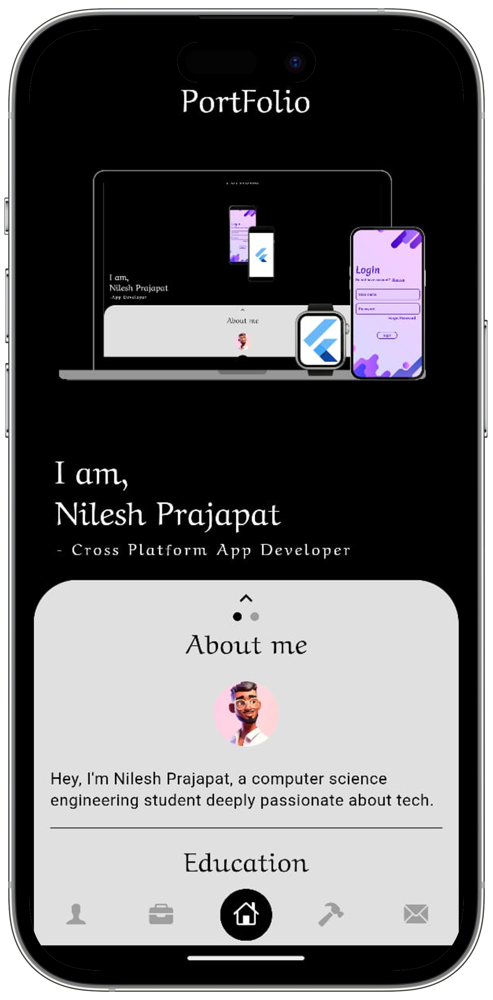
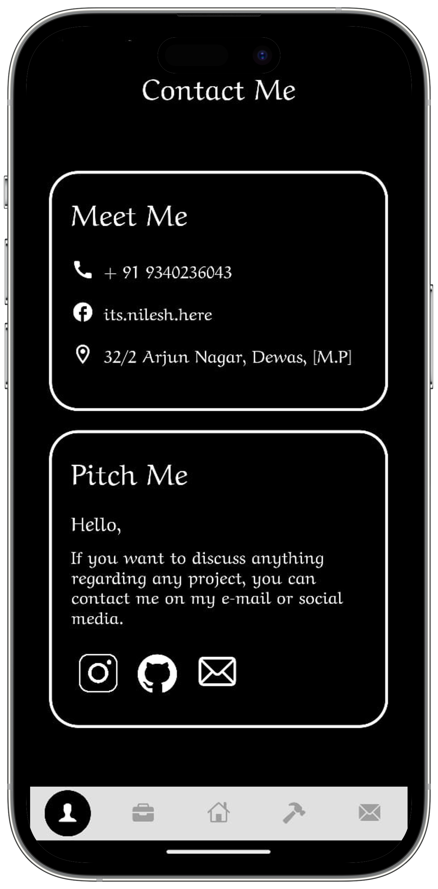
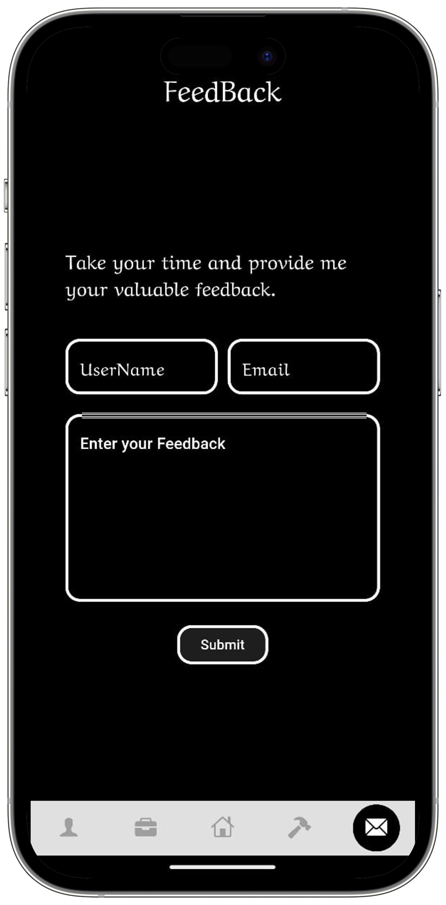

<!DOCTYPE html>
<html lang="en">
<head>
  <meta charset="UTF-8">
  <meta name="viewport" content="width=device-width, initial-scale=1.0">
</head>
<body>

  <h1>📱 Flutter Portfolio App</h1>

  
This is a simple personal portfolio app built using <strong>Flutter</strong>. It showcases my bio, skills, projects, and even includes a feedback form to connect with users. Built entirely as a mobile app for Android.

  <h2>🔹 App Sections</h2>
  <ul>
    <li>👤 About Me</li>
    <li>🛠️ Skills</li>
    <li>📂 Projects</li>
    <li>📞 Contact</li>
    <li>💬 Feedback</li>
  </ul>

  
<strong>Platform:</strong> Android (APK only, not deployed online)

  
<strong>Status:</strong> Archived – no further updates planned ❌

  <h2>🛠️ Tech Stack</h2>
  <ul>
    <li>💙 <strong>Frontend:</strong> Flutter</li>
    <li>📡 <strong>Backend:</strong> None (Feedback not stored online)</li>
  </ul>

  <h2>📱 App Mockups</h2>
<table width="100%">
  <tr>
    <td align="center"></td>
    <td align="center"></td>
    <td align="center"></td>
  </tr>
  <tr>
    <td align="center"></td>
    <td align="center"></td>
    <td align="center"></td>
  </tr>
</table>

  <h2>🚀 How to Run</h2>
  
Follow these steps to run the app on an Android device:

  <pre>
git clone https://github.com/your-username/flutter-portfolio-app.git
cd flutter-portfolio-app
flutter pub get
flutter run -d android
  </pre>

  <h2>ℹ️ Additional Notes</h2>
  <ul>
    <li>🔒 No backend – feedback form is not connected to any server.</li>
    <li>📱 UI optimized for mobile portrait screens.</li>
    <li>🛑 This project is no longer being maintained.</li>
  </ul>

  <footer>
    

    
🚀 Made with ❤️ by <strong>Nilesh Prajapat</strong>

<em>📚 A Flutter journey fueled by curiosity, crafted with passion, and powered by coffee ☕</em>

  </footer>

</body>
</html>
